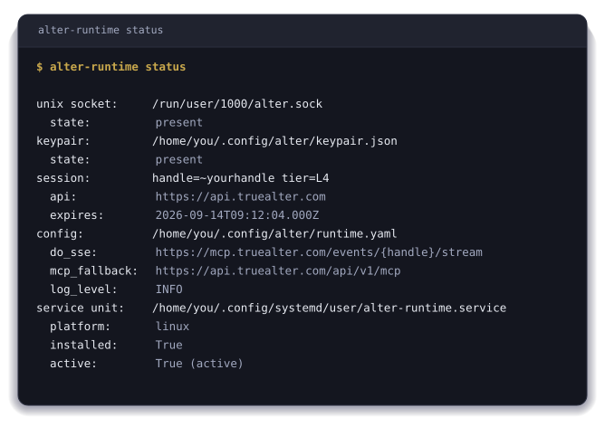

<div align="center">


# ~alter Runtime

**The part of ~alter that runs on your machine and answers to you.**

[](https://pypi.org/project/alter-runtime/)
[](https://pypi.org/project/alter-runtime/)
[](#install)
[](#install)
[](./LICENSE)

[What is ~alter?](#what-is-alter) · [Install](#install) · [Running it, start to stop](#running-it-start-to-stop)

</div>

## What is ~alter?

A login is true for the instant it is checked, and it says nothing at all about
the hours on either side of it. Identity that exists only while somebody is
looking is not identity, it is a permission, granted for one moment and then
forgotten by the thing that granted it.

~Alter is the record that holds between the checks. What sits under your
`~handle` was read from work you actually did rather than typed into a form, so
it holds when the host changes, when the stack changes, and when the job does.

You are the gate on it. Nothing is readable until you have said so, in advance
and by category rather than one request at a time, and a reader who wants more
than your name pays you for the rest.

<details><summary><b>I want to know more</b></summary><br><p>Your friends do not know you from a login. Neither does your family, or the people you work with, or your sports team. They know who you are from how you have shown up, over years. You may look and sound nothing like you did ten years ago and it is still you.</p><p>Software still asks the narrow question. A password at the login screen. A token in the app. Each one checks whether this is the right person, right now, at this exact spot, and then looks away. Everything in between is invisible to it, and that is almost all of your life. The AI tools made it worse, because one of them writes in your name now, and when somebody asks who allowed it, there is no answer anywhere on this machine.</p><p><b>One name, and the record under it is yours.</b> <code>~yourname</code> works at every tool that speaks the protocol, so nothing is set up twice and there is no key to paste, at any point. What is in the record was read from what you did, not typed into a box by you or guessed at by a model. You can cut off access to any of it with one command. No form, no review.</p><p><b>Being read pays you.</b> Anyone can check for free that your handle exists. Reading further, past the fact of you, costs the reader money, that money goes to you, and you decide who gets to read what. Collectives hold a record on the same terms, because it is one record at every scale and the same form holds you, your team, and your country. A union, a club, a trade body, or a group of people who have never met can vouch for their own members and be read the same way you are.</p><p><b>Threads are how you get somewhere.</b> A thread is something you are working towards. You take one on yourself, or ~Alter plants one from what it can already see, or a collective confers one on you. What gets read is the trail you leave while you are doing it, never a certificate at the end.</p><p>All of that is the short version of an argument set out properly, in eight chapters at <a href="https://truealter.com/origin">truealter.com/origin</a>. Its seventy-six predictions were each written so the data could come back and say no. Five of them did, and those five are still published alongside the rest.</p></details>

<details><summary><b>I want to check it myself</b></summary>

None of it needs taking on trust. Hand this to the AI you already use and
let it take you through in your own words.

```text
Go to truealter.com, find the genesis and the origin papers, and read all of
them. Then start a discussion with me in my own language, no jargon.

Ask me one question at a time and wait for my answer. Follow what I am curious
about, not the order the site is written in.

Do not only read the pages. Connect to their interface directly and call
get_started. That tells you where I am and what comes next, and we work the
rest of this from there.

If I have a ~handle I will give it to you. If I do not and I decide I want
one, set it up with me here.

What I want to understand is what ~Alter is, how it applies to me, and what it
means for everyone else. Find me somewhere in it, and not the version written
for people who work in technology. Find the life nearest mine and walk me
through it, including what it would cost me.

Try to prove them wrong. Go and find where they show their working, and if
something is unclear or does not hold up, say so.
```

</details>

## What is ~alter Runtime?

A daemon on your own machine that stays awake so the record under your `~handle`
is continuous rather than a series of moments when a command happened to be
typed. A thing observed only when it is polled has no history, it has samples,
and everything falling between two samples is a gap nobody can account for
afterwards.

The runtime closes that gap. It watches the ref files in your repositories, so a
commit is observed as it lands rather than reconstructed from a log later. It
watches the working tree, so a save registers even in an editor that offers no
hook. It subscribes to your own identity field over a long-lived stream, and
when that stream goes quiet it polls instead, without your surfaces ever knowing
which path served them.

It comes back on its own. The service unit starts it at login and restarts it on
failure, and inside it a supervisor restarts any component that dies, backing
off as it goes. It keeps the last state it saw on disk, so the shell prompt, the
status bar and the editor hook have something to draw the moment they ask, with
no network and no waiting.

This is the part nobody thinks to ask for. The [command
line](https://truealter.com/build) is the front door and what most people
install, and this is the process running underneath while nothing is being asked
of it.

The rest of this page is the install, and running it.

## Install

You need Python 3.10 or newer. Nothing else, and nothing to configure.

```bash
pip install alter-runtime
```

That is every platform, and it is the only channel this daemon is published on.
The Homebrew tap carries the command line and not the runtime, so on macOS this
is the way in.

<details><summary><h3>The optional extras</h3></summary>

- **`pip install 'alter-runtime[dbus]'`** puts your handle on the session bus,
  which is what the GNOME, KDE and Waybar modules read.
- **`pip install 'alter-runtime[systemd]'`** for the Linux service unit.
- **`pip install 'alter-runtime[windows]'`** pulls the Windows service
  dependencies. The service itself is not wired yet.
- **`pip install 'alter-runtime[ebpf]'`** for the kernel attestation subscriber.
- **`pip install 'alter-runtime[all]'`** takes the lot.

</details>

## Running it, start to stop

This daemon keeps a `~handle` known on your machine, so it assumes you already
hold one. If you do not, the [first five
minutes](https://truealter.com/build) in the command
line walks it, starting with `alter audit`, which shows what is readable about
you before you have an account at all.

### 1. Set it up

Run `alter-runtime init`.

It generates the device keypair, makes the directories it needs, and checks the
session the command line left behind. Nothing leaves the machine.

### 2. Start it

Run `alter-runtime start`.

It installs and enables the host service unit, systemd on Linux and launchd on
macOS. It shows you every artefact it is about to write, with sizes and digests,
and waits for your yes. Add `--dry-run` to see the unit file and the commands
without touching anything, or `--yes` to skip the prompt in a script.
`alter-runtime daemon` runs it in the foreground instead, which is what you want
while you are debugging.

### 3. See where it stands

Run `alter-runtime status`.

The socket, the keypair, the session and its expiry, the config it loaded, and
whether the service unit is installed and active. It is the one command to come
back to.

<div align="center">



</div>

### 4. Read your own field

Run `alter-runtime query`.

It answers from the materialised view the daemon is holding, so it answers with
no network when the edge is away.

### 5. Stop it

Run `alter-runtime stop`.

Disables and stops the unit. The keypair and the config stay where they are.

<details><summary><h3>What it does while it runs</h3></summary>

- **Subscribes** to your own handle's event stream at
  `https://mcp.truealter.com/events/<yourhandle>/stream`, over Server-Sent
  Events.
- **Falls back to polling** `https://api.truealter.com/api/v1/mcp` when that
  stream has been silent for seventy-five seconds, three times the server's
  keepalive interval. Your surfaces never know which path served them.
- **Exposes two local transports.** A Unix socket carrying line-delimited JSON
  at `/run/user/$UID/alter.sock` on Linux or
  `~/Library/Application Support/alter/runtime.sock` on macOS, which is what
  editor hooks and shell scripts read. D-Bus, the `org.alter.Identity1`
  interface on the session bus, which is what the GNOME, KDE and Waybar modules
  read.
- **Collects ambient signals.** Commits and branch switches, read from the ref
  files as they change. Working-tree saves, for editors that offer no hook. Exec
  attestations from the kernel over eBPF, on Linux, filtered to your own uid
  before the daemon sees them.
- **Keeps a local cache** of the last good state, so your surfaces stay
  continuous across restarts and dropouts rather than blanking out.

</details>

<details><summary><h3>Where your key is kept</h3></summary>

On the first `alter-runtime init` the device key file is written to
`~/.config/alter/keypair.json`, or `$XDG_CONFIG_HOME/alter/keypair.json` when
that variable is set. It is opened at `0600` from the first byte rather than
written and then tightened, so no local process gets a window in which to read
it. It never leaves the device.

Generation is a scaffold in this alpha. The file lands at the right path, at the
right mode, in the right shape, and the Ed25519 material is not yet generated
into it, so nothing here signs with a device key today. Wiring that generation,
and binding it to a device passkey, is the work this shape is being held for.

The filesystem rather than an OS keychain is deliberate. It keeps the daemon
self-contained on any POSIX host without a hard dependency on a distro-specific
secret store while this is being tested. Linux `libsecret` and `kwallet`, macOS
Keychain and Windows Credential Manager come later behind a config knob, and the
filesystem stays the documented fallback.

</details>

<details><summary><h3>This is an alpha</h3></summary>

The public surface can change in ways that break you before the stable release.
That is the CLI flags, the Unix-socket JSON schema, the D-Bus interface and the
Python SDK signatures. Pin an exact version in anything downstream before you
upgrade.

Security reports go to `security@truealter.com`, never a public issue. Anything
else is `support@truealter.com`.

</details>

<details><summary><h3>Reading it from your own code</h3></summary>

```python
import asyncio
from alter_runtime import AlterClient


async def main():
    # Returns a direct MCP client. Preferring the local daemon's socket
    # is the intent of this constructor and is not wired yet.
    client = AlterClient.auto_discover()

    async with client:
        response = await client.whoami()
        print(response.extract_text())

        attunement = await client.attunement()
        print(attunement.extract_text())


asyncio.run(main())
```

`alter-runtime send ~peer "..."` sends a message through the running daemon,
which holds the session and does the authenticated send itself. `alter-runtime
ingest --kind <kind> --payload '<json>'` prints the envelope it would send and
stops there, because the shell path into the daemon is not wired yet.

</details>

<details><summary><h3>The protocols underneath it</h3></summary>

The record formats are open Internet-Drafts, so somebody else's implementation reads and writes the same records this one does without asking us. These are the drafts this repository actually rests on.

| Draft | What it specifies |
|---|---|
| [`mcp-dns-discovery`](https://datatracker.ietf.org/doc/draft-morrison-mcp-dns-discovery/) | The DNS records that publish a `~handle`, the server that answers for it, and the signed envelope bound to it. |
| [`alter-uri-scheme`](https://datatracker.ietf.org/doc/draft-morrison-alter-uri-scheme/) | The `alter:` URI, so a `~handle` reference resolves, verifies and dispatches to a handler on the machine. |
| [`agent-channel-fan-out`](https://datatracker.ietf.org/doc/draft-morrison-agent-channel-fan-out/) | The frame several concurrent agent sessions of one principal use to exchange short structured messages. |
| [`binding-moment-envelope`](https://datatracker.ietf.org/doc/draft-morrison-binding-moment-envelope/) | The wire structure an agent uses to put a consequential decision to the person it acts for, and how they answer. |
| [`substrate-observation`](https://datatracker.ietf.org/doc/draft-morrison-substrate-observation/) | Why cross-session coordination is observed from substrate rather than negotiated as a wire format. |

Eighteen drafts make up the whole stack. The rest are on the [IETF datatracker](https://datatracker.ietf.org/doc/search/?name=draft-morrison&activedrafts=on).

</details>

<details><summary><h3>The rest of it</h3></summary>

`~alter` is one identity rail with several ways in, and this daemon is the part
that runs on your own machine.

| Name | What it is |
|---|---|
| **cli** | The command line, and the front door for a person. |
| **[homebrew-tap](https://github.com/true-alter/homebrew-tap)** | That command line, packaged for macOS and Linux. |
| **runtime** | The daemon that keeps your `~handle` known on your own machine. **You are here.** |
| **[sdk](https://github.com/true-alter/sdk)** | Reading identity from your own code. |
| **[obsidian](https://github.com/true-alter/obsidian)** | ~Alter inside an Obsidian vault, on-device. |
| **[mcp-ollama](https://github.com/true-alter/mcp-ollama)** | Local models, for work that should stay on the machine it runs on. |

| Where to read more | |
|---|---|
| Website | [truealter.com](https://truealter.com) |
| The reasoning behind it | [truealter.com/origin](https://truealter.com/origin) |
| Getting started | [truealter.com/build](https://truealter.com/build) |
| What the tools do | [truealter.com/docs/mcp/tools](https://truealter.com/docs/mcp/tools) |
| The open specifications | [the draft stack](https://datatracker.ietf.org/doc/search/?name=draft-morrison&activedrafts=on) |

Apache-2.0, see [`LICENSE`](./LICENSE).

</details>

---

<div align="center">

<sub><b>~alter</b> is identity infrastructure. Your name is <code>~yourname</code> and claiming one is free.</sub>

<sub>
<a href="https://truealter.com">Website</a> &nbsp;·&nbsp;
<a href="https://truealter.com/docs">Docs</a> &nbsp;·&nbsp;
<a href="https://truealter.com/origin">The argument in eight chapters</a> &nbsp;·&nbsp;
<a href="https://datatracker.ietf.org/doc/search/?name=draft-morrison&activedrafts=on">The open specifications</a> &nbsp;·&nbsp;
<a href="https://github.com/true-alter">Every repository</a>
</sub>

</div>
